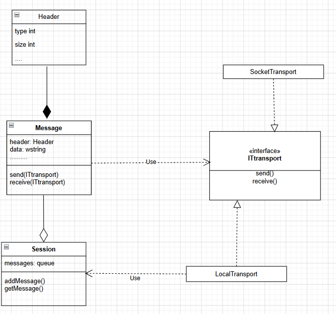

# NetworkTransport-ThreadController
## Возможности:
- Управление потоками на сервере (создание/остановка)
- Отправка сообщений:
  - Главному потоку
  - Всем потокам (broadcast)
  - Конкретному потоку
- Асинхронная обработка соединений
- Персистентное хранение сообщений (в `./msgs/`)

## Технологии:

### Сервер (C++)
- **Boost.Asio** — асинхронная сеть
- **STL** — потоки, контейнеры, файловый ввод/вывод
- **Сериализация** — бинарная через memcpy

### Клиент (C#)
- **WinForms** — GUI
- **P/Invoke** — вызовы DLL
- **Многопоточность** — фоновый прием сообщений

### Библиотека (NetworkLibCherkasov.dll)
- **Паттерн Стратегия** — интерфейс `ITransportCherkasov` определяет контракт для транспортных стратегий:
  - `ClientTransportCherkasov` — клиентская стратегия (TCP-соединение к серверу)
  - `ServerTransportCherkasov` — серверная стратегия (обработка входящих соединений)
  - `LocalTransportCherkasov` — локальная стратегия (межпотоковое взаимодействие)
- **DLL-экспорт** — C-совместимые функции для C# P/Invoke
- **RAII** — автоматическое управление ресурсами
- **Потокобезопасность** — мьютексы для конкурентного доступа

